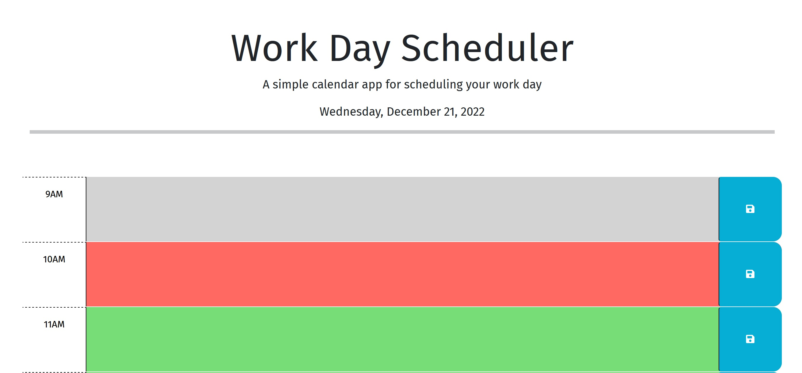

# Boot Camp - Module 5 Challenge - Third-Party APIs Challenge: Work Day Scheduler

## About

A jQuery coding challenge for Full Stack Coding Boot Camp.

## Description

For this project, I learned a lot about how to use the Day.js API and chain jQuery methods. I had the easiest time with the Day.js API, while I was most challenged by figuring out how to split arrays with jQuery.

## Technologies

HTML, CSS, Bootstrap, Google Fonts, JavaScript, jQuery, Web Storage API, Day.js, Git, GitHub, VS Code, Chrome, Firefox

## Screenshot

## Deployment

[GitHub Pages](https://kkarrwrites.github.io/boot-camp-module-05-challenge-work-day-scheduler/)

## License

This project is licensed under the MIT License.

## Resources

### JavaScript

- [String.prototype.split()](https://developer.mozilla.org/en-US/docs/Web/JavaScript/Reference/Global_Objects/String/split) on MDN

### jQuery

- [.addClass()](https://api.jquery.com/addClass/) on jQuery
- [$( document ).ready()](https://learn.jquery.com/using-jquery-core/document-ready/) on jQuery
- [.each()](https://api.jquery.com/each/) on jQuery
- [.find()](https://api.jquery.com/find/) on jQuery
- [.hide()](https://api.jquery.com/hide/) on jQuery
- [.html()](https://api.jquery.com/html/) on jQuery
- [jQuery Tutorials for Beginners](https://www.youtube.com/playlist?list=PL4cUxeGkcC9hNUJ0j6ccnOAcJIPoTRpO4) by The Net Ninja
- [.on()](https://api.jquery.com/on/) on jQuery
- [.parent()](https://api.jquery.com/parent/) on jQuery
- [.show()](https://api.jquery.com/show/) on jQuery
- [.text()](https://api.jquery.com/text/) on jQuery
- [.val()](https://api.jquery.com/val/) on jQuery

### Web Storage API

- [How to Use Local Storage with JavaScript](https://www.taniarascia.com/how-to-use-local-storage-with-javascript/) by Tania Rascia
